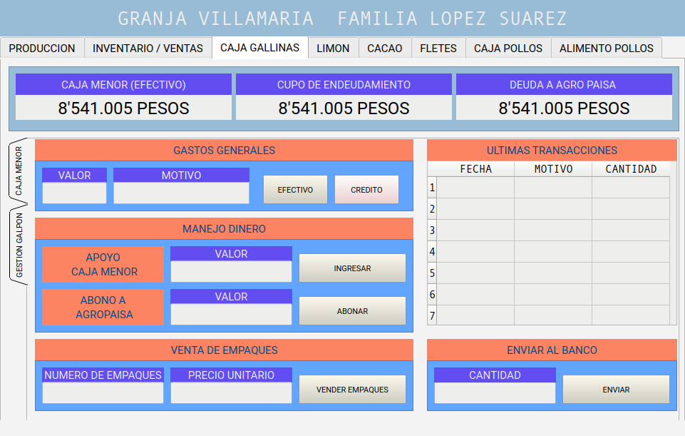
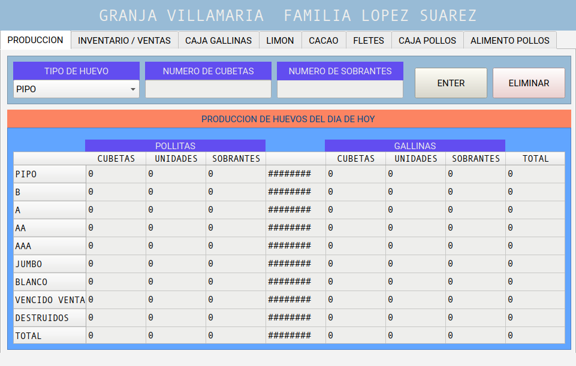

  Huevos-familia-lopez<\center>
 
  
     
 
 Heading Identifiers:
### Red text title {#identifier .red}

Fenced Code Attributes:
{.red .numberLines startFrom="1"}

Inline Code Attributes:
`red text`{.red}

Bracketed Spans:
[This is *some red text*]{.red}

Link Attributes:
{.center}

.img {
  horizontal-align: middle
}
---

**version 2.0**

El sistema de gestion familiar es un programa orientado a la gestion de productos y recursos asociados a la produccion agricola. Para ello se permite al usuario tener un registros historicos de alimentacion de gallinas y pollitas

El sistema de gestion de huevos, alimentos y otros insumos esta diseñado para que el usuario tenga la posibilidad de conocer y manejar los recursos producto de bienes agroindustriales, para ello se apanlanca
# Requerimientos 

- [python 3.9 or older](https://www.python.org/downloads/windows/)
- [pandas](https://pandas.pydata.org/pandas-docs/version/0.23.3/install.html)
- [PyQt5](https://pypi.org/project/PyQt5/)
- [pyqtgraph](http://www.pyqtgraph.org/) 

los ultimos 3 requerimientos se recomienda realizar su instalacion por medio del PIP 

# Derechos reservados 
Creative Commons 2021

# Uso 

 - Pestaña Huevos Diario
 - inventario y ventas
 - algo mas
# Derechos Reservados 

# Autores : 
- [Johan Ramirez](https://github.com/joaramirezra)
